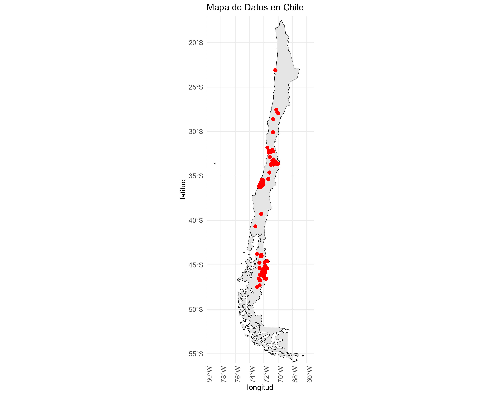

# Modelos de regresión para estimación de capacidad de campo y punto de marchitez permanente

IPRE de verano 2025

### Objetivo

Usando el dataset [ChSPD Chilean soil profile database V2](https://zenodo.org/records/13870760) se desarrollaron modelos lineales y de Random Forest para la estimación de capacidad de campo y punto de marchitez permanente.

### Metodología

1.  Se asistió a Talleres de R para datos urbanos: [Intro a R por CEDEUS](https://github.com/Saryace/intro_r_cedeus)
2.  Se asistió a un Taller de RLadiesBA: [¡NA pasa nada!: aprende a validar datos con R](https://mcnanton.github.io/RladiesBA-TallerValidacionDatos/)
3.  Se realizó una visualización geoespacial de los datos.
4.  Se realizó una validación y testeo del dataset original usando las librerías pointblank, data.validator, assertr, validate.
5.  Se desarrollaron modelos de regresión (lineales y Random Forest) para predecir la capacidad de campo y el punto de marchitez permanente
6.  Se disponibilizaron los resultados por medio de código abierto (este repositorio) y una Shiny App.

### Uso de la Shiny App

La Shiny App permite interactuar con los modelos y obtener predicciones de FC y PWP en tiempo real. Puedes acceder a la aplicación en: [ENLACE A TU SHINY APP].

Para ejecutar la aplicación localmente:

1.  Clona este repositorio.
2.  Abre el archivo `app.R` en RStudio.
3.  Asegúrate de tener las dependencias instaladas. Puedes usar `renv` para restaurar el entorno: `R     install.packages("renv")     renv::restore()`
4.  Ejecuta la aplicación con el botón "Run App" en RStudio.

### Mapa de datos

Se realizo un mapa con la ubicacion de los datos 

### Dependencias

-   shiny
-   parsnip
-   ranger (si usaste Random Forest)
-   Librerías de validación de datos: pointblank, data.validator, assertr, validate

### Contribución

Las contribuciones son bienvenidas. Si encuentras algún error o tienes alguna sugerencia, por favor, abre un "issue" o envía un "pull request".

### Autores

-   Sara Acevedo
-   Agustín Coddou

### Agradecimientos

Se agradece especialmente a [Sara Acevedo](%5BSaryace%20(Sara%20Acevedo)%5D(https://github.com/Saryace)) por su valioso apoyo y guía, mostrando de manera clara y didáctica los principios de la programación. Asimismo, se extiende un agradecimiento a [R-Ladies Buenos Aires](#0){style="font-size: 11pt;"} por sus talleres de programación.
